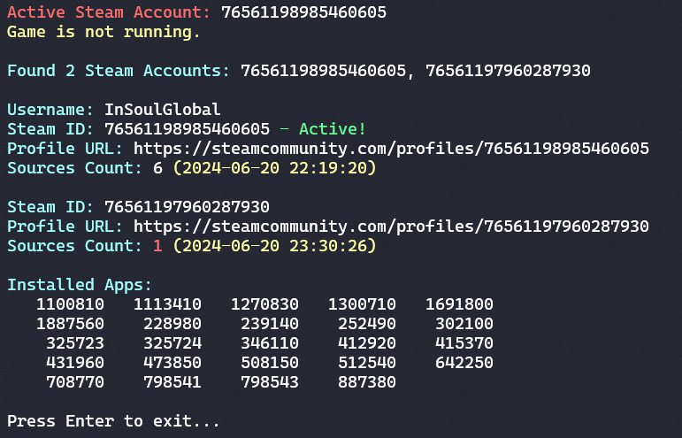

# SteamAccountsConsole

### Preview

## Features

- Determine active steam account
- Running game PID
- All steam accounts on PC from multiple sources
- All installed games
- Information about account such as:
  - Username
  - SteamID64
  - Profile URL
  - Count of sources where account was found
  - Potential Last account usage date
  
Created by [R-Udren](https://github.com/R-udren)
Discord - `insoulglobal`
